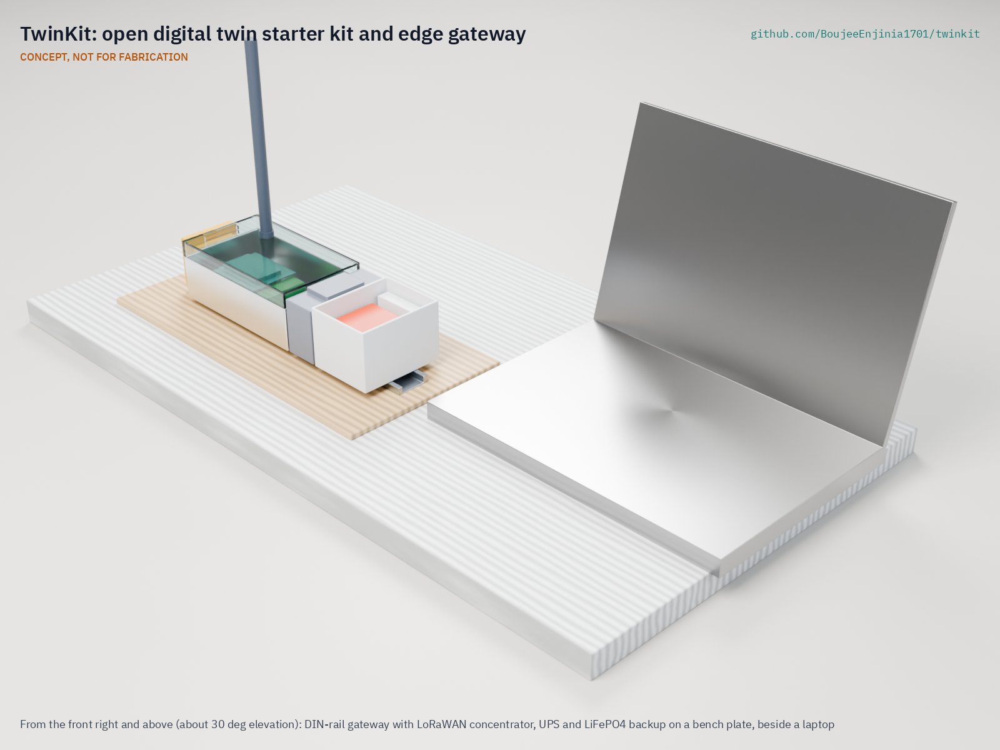

# TwinKit

  

**Area:** Digital Twins · **TRL:** 3 of 9 (proof of concept on paper) · **Prototype budget:** about $300 USD · **Difficulty:** 3 of 5

An open digital twin starter kit: a small edge gateway that collects readings from lab sensors (FieldNode and others), plus software that ties live data to each project's build123d model so it can be seen and compared with the design calculations.

[Detail render](media/render-detail.png) · [Interactive 3D model](media/viewer.html) · [Concept blueprint (PDF)](media/concept-blueprint.pdf) · [General arrangement (PDF)](cad/drawings/TWK-DWG-001.pdf) · [Sizing calculations](docs/04-calcs/01-sizing.md) · [Review note](docs/REVIEW.md)

## Concept rationale

Every lab project already has a parametric model and calculated targets. Linking those to live readings closes the loop between design and reality at low cost: instead of alarming on fixed limits, the twin shows where a device departs from what its own calculation predicted, and on which part of the model.

The kit is open and garage-buildable because the pieces already exist as off-the-shelf modules and open-source software. What is missing is the thin mapping layer between sensor channels, model parts and calculations, and a small offline gateway that a small team can assemble on a DIN rail, inspect and adapt.

## Burning platform

Small operators find faults late because they lack the monitoring that large operators take for granted. Water utilities alone lose an estimated 126 billion m³ of treated water a year, worth nearly $40 billion ([World Bank](https://blogs.worldbank.org/en/ppps/what-do-private-companies-look-performance-based-non-revenue-water-project)), and about one in four handpumps in sub-Saharan Africa is out of service at any time ([Foster et al., 2019, via IRC](https://www.ircwash.org/resources/functionality-handpump-water-supplies-review-data-sub-saharan-africa-and-asia-pacific)).

Digital twin platforms are priced for large firms, yet small and medium enterprises make up about 90 % of businesses and more than half of employment worldwide ([World Bank](https://www.worldbank.org/en/topic/smefinance)). An open kit that runs on one small gateway puts the same early-warning idea within their reach.

## Where it could be used

### By industry

| Industry | Use |
| --- | --- |
| Water supply | Compare tank levels, pump run time and flow with the expected demand curve to catch leaks and pump faults early |
| Off-grid energy | Track battery state of charge and solar yield against the design power budget in mini-grids and solar kits |
| Small manufacturing | Watch machine temperature, vibration or energy use against the process calculation |
| Cold chain and storage | Compare cold room or grain store temperatures with the thermal model |
| Education and research | Teach model-based design with a twin students can build and inspect |
| Municipal services | Gateway and data layer for street sensors through CityTwin |

### By country or region

| Country or region | Why it matters there |
| --- | --- |
| Kenya | Water utilities report a national average non-revenue water of 44 % ([WASREB, 2025](https://wasreb.go.ke/wp-content/uploads/2025/06/IMPACT-REPORT-17.pdf)); low-cost monitoring helps find losses |
| Sub-Saharan Africa | About one in four handpumps is non-functional at any time ([Foster et al., 2019](https://www.ircwash.org/resources/functionality-handpump-water-supplies-review-data-sub-saharan-africa-and-asia-pacific)); remote twins can flag failures sooner |
| India | About 63.4 million unincorporated micro, small and medium enterprises in the 2015 to 2016 survey ([PIB, Ministry of MSME](https://www.pib.gov.in/Pressreleaseshare.aspx?PRID=1555596)), most without access to enterprise monitoring tools |
| Brazil | About 37.8 % of treated water was lost in distribution in 2022 ([Instituto Trata Brasil](https://tratabrasil.org.br/wp-content/uploads/2024/06/Release-Perdas-de-Agua-2024.pdf)) |
| European Union | 99 % of the 32.3 million enterprises are micro or small ([Eurostat, 2024](https://ec.europa.eu/eurostat/web/products-eurostat-news/w/ddn-20241025-1)); an open kit suits firms too small for vendor twin platforms |
| Singapore | [Virtual Singapore](https://oecd-opsi.org/innovations/virtual-twin-singapore/) shows the value of a national twin; TwinKit offers a small, open counterpart for campuses, buildings and schools |

## What sparked the idea

The idea traces back to Apollo 13 in April 1970. After an oxygen tank failed, the procedures to bring the crippled command module back to life were worked out on the ground against a model of the spacecraft: NASA's history notes that Ken Mattingly "had spent hours in the CM simulator finalizing the procedures" before the crew ran them ([NASA, 2020](https://www.nasa.gov/history/50-years-ago-apollo-13-crew-returns-safely-to-earth/)). That pairing of a model with the state of the real system, later formalized as the digital twin ([Grieves and Vickers, 2017](https://link.springer.com/chapter/10.1007/978-3-319-38756-7_4)), then needed a room of simulators and a mission control center. TwinKit asks whether the same loop of model, live readings and comparison can run on one DIN rail gateway for a small device, using the model and calculations each project already has.

## Problem

Digital twins are sold as enterprise software, out of reach for small builders and cities, yet the idea is simple: a model, live data and a comparison between them.

## Concept

A DIN rail edge gateway (single-board computer, 8-channel LoRaWAN concentrator, 12 V input and LiFePO4 backup) runs open-source software that receives readings from FieldNode and other sensors, stores a year of data offline, and shows each reading on the project's build123d model next to the value its design calculation predicted. TRL 3 calculations ([TWK-CAL-001](docs/04-calcs/01-sizing.md)): 50 nodes at 5 min with 0.21 % uplink loss using adaptive data rate (target under 1 %), 6.4 W average, 2.4 h of backup, 4.7 GB of data a year, and $290 in parts within the $300 budget. At 40 °C ambient the processor stays about 16 K below its assumed throttle point at normal load; heavy database jobs are scheduled for cool hours. Fifteen of sixteen requirements are met on paper; setup time needs a timed trial.

Full design precis: [docs/02-concept.md](docs/02-concept.md)

## Key components

- Single-board computer (4 GB) in a vented 9-module DIN rail enclosure
- 8-channel LoRaWAN concentrator HAT and antenna (Wi-Fi and Ethernet built in; cellular optional)
- 12 V DC input (9 to 30 V) with 3.15 A time-delay fuse, DC-DC converter, DIN UPS module with buck-boost charger and 12.8 V LiFePO4 backup pack
- Open-source network server, MQTT broker, TimescaleDB and dashboard
- TwinKit twin service and model-to-data mapping schema
- Example twin of FieldNode's battery and solar charge

The priced bill of materials is in [bom/bom.csv](bom/bom.csv). The parametric model is [cad/src/model.py](cad/src/model.py), with STEP and STL exports in `cad/step/` and `cad/stl/`.

## Safety

> Low voltage only (12 V DC); use a certified mains adapter. The backup pack is a LiFePO4 battery: use a pack with a built-in BMS and fuse, charge it only through the UPS module and never leave a first build charging unattended. Secure the gateway: change default credentials and keep it off public networks until it is hardened. TwinKit is a monitoring aid, not a safety system.

## Repository layout

| Folder | Contents |
| --- | --- |
| `docs/` | Problem, concept, requirements, calculations and design decisions |
| `cad/src/` | build123d Python source, the source of truth for all geometry |
| `cad/step/`, `cad/stl/` | Exported models for FreeCAD, other CAD tools and printing |
| `cad/drawings/` | 2D sketches and dimensioned drawings |
| `bom/` | Bill of materials |
| `electronics/` | KiCad schematics and PCB layouts |
| `firmware/` | Microcontroller code |
| `media/` | Renders, perspectives and photos |
| `build-log/` | Dated prototyping notes |

## Documentation

Controlled documents follow the portfolio [documentation standard](.kit/STANDARDS.md). Each carries a document ID (TWK-PRC-001 for the precis), a version and a revision history. Branded PDFs are built with `python .kit/render.py` and attached to GitHub Releases when a document is tagged, for example `TWK-PRC-001/v1.0`.

## Credits

Designed by Amish Chadha. See [CONTRIBUTORS.md](CONTRIBUTORS.md) for roles. To cite this design, use [CITATION.cff](CITATION.cff) (GitHub shows it as "Cite this repository").

AI assistance (Claude) was used to accelerate concept renders, prototype documentation and first-pass sizing calculations. Design direction and all decisions are Amish Chadha's, recorded in this repository's decision records (`docs/decisions/`).

## Licenses

- **Hardware** (CAD, drawings, BOM, electronics): [CERN-OHL-S v2](LICENSE)
- **Software** (firmware, scripts, notebooks): [MIT](LICENSE-SOFTWARE)

A project of the [Design Molecule](https://designmolecule.com) lab.
