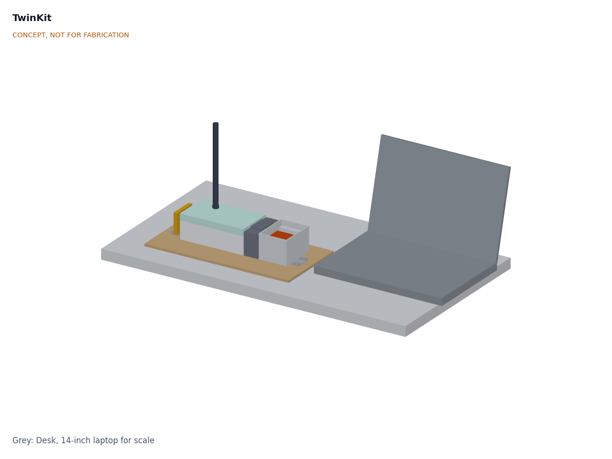
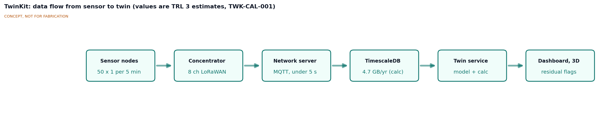
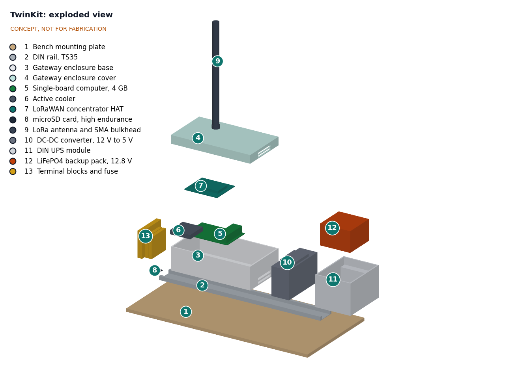
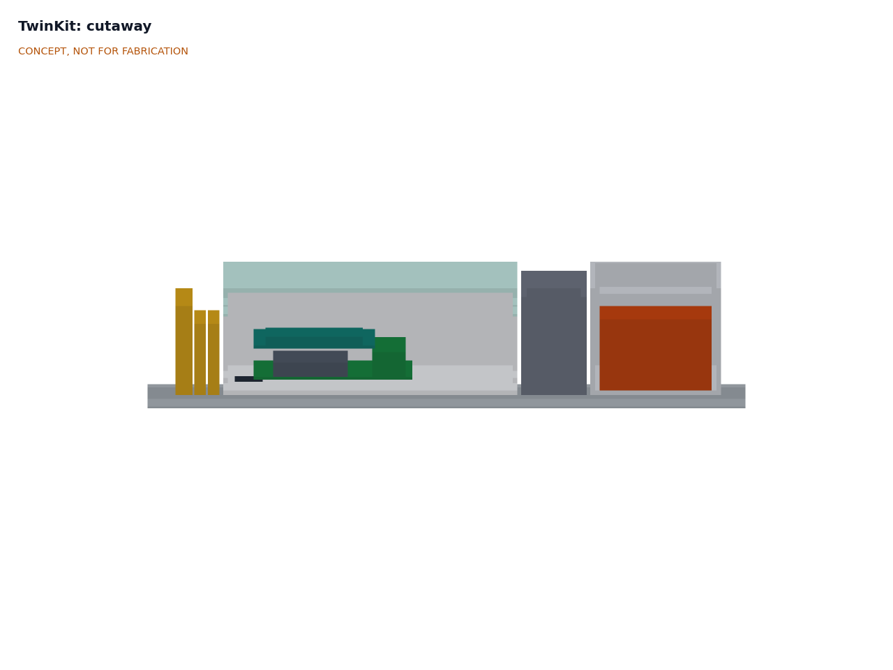
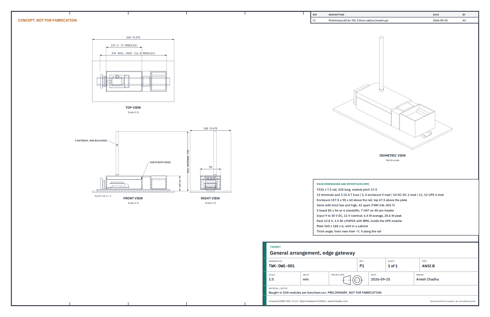

# TwinKit design precis

TwinKit is a small DIN rail edge gateway plus open software that receives sensor readings, stores them, and shows each reading on the project's own build123d model next to the value the design calculation predicted. The TRL 3 calculations (TWK-CAL-001) show one single-board computer with a LoRaWAN concentrator serving 50 sensor nodes, storing a year of data in 4.7 GB and riding through a 2.4 h outage on 6.4 W. Two requirements are not met: uplink loss is 1.02 % against 1 % if all 50 nodes use SF9 at 5 min (R1), and parts cost $290 against the $200 budget (R14); a $300 budget is recommended and awaits Amish. Processor throttling at 40 °C under sustained full load is a risk (R12). The design choices below were proposed at TRL 2 and are adopted for TRL 3 pending Amish's review (TWK-DDR-001).



Figure 1. Gateway on a DIN rail and bench plate, with a desk and 14-inch laptop for scale.

## How it works

1. **Sense.** Sensor nodes such as FieldNode (a sibling lab project) send small readings over LoRa radio. Other devices can post over MQTT or HTTP on the local network.
2. **Receive.** An 8-channel LoRaWAN concentrator on the gateway hears all nodes in range; an open-source network server decodes the packets and publishes them to a local MQTT broker.
3. **Store.** A time-series database on the gateway keeps every reading with its node, channel, unit and time.
4. **Map.** A mapping file for each project (the twin file) links every channel to a named part of the project's build123d model, using the same part names and BOM numbers the concept media already use, and to an expected value: a constant, a curve, or a function from the project's calculation note.
5. **Compare.** The TwinKit twin service computes the residual (measured minus expected) for each reading and raises a flag when it stays outside the stated tolerance for the stated time.
6. **Show.** A browser dashboard shows trends and flags, and a 3D view loads the project's `model.glb` and colors each mapped part by its live value or residual.



Figure 2. Data flow from sensor to twin. Values are estimates.

An illustrative twin file for the first example (FieldNode) reads:

```yaml
project: fieldnode
model: media/model.glb
channels:
  - id: battery_v
    node: fieldnode-01
    part: 4            # BOM number of the LiFePO4 cell in FieldNode's model
    unit: V
    expected: calc.power_budget.soc_to_voltage   # from FieldNode's calculation note
    tolerance: 0.1
    hold: 30 min
```

The schema fields (project, model, and per channel an id, node, part, unit, expected value, tolerance and hold time) are adopted for TRL 3 pending Amish's review (TWK-DDR-001). The hold time sets how fast a fault is flagged: with a 30 min hold, a step fault is flagged within 35 min at 5 min readings (TWK-CAL-001 [C2]). The twin service commits readings in batches every 10 s to limit card wear (TWK-CAL-001, section B).

## Main components

Table 1. Main components (numbers match `bom/bom.csv` and Figure 3).

| # | Component | Proposed choice | Notes |
| --- | --- | --- | --- |
| 1, 2 | Bench plate and DIN rail | 6 mm plate, TS35 rail | Plate optional when an equipment cabinet exists |
| 3, 4 | Gateway enclosure | 9-module DIN enclosure, vented, clear cover | Holds the computer and concentrator |
| 5, 6 | Single-board computer and cooler | 4 GB quad-core Arm board (Raspberry Pi 5 class) | Runs all software; about 2.4 GB used. Adopted for TRL 3 pending Amish's review (TWK-DDR-001) |
| 7 | LoRaWAN concentrator | SX1302 or SX1303 8-channel HAT | Region version (EU868 or US915). Adopted for TRL 3 pending Amish's review (TWK-DDR-001) |
| 8 | Storage | 64 GB high-endurance microSD | SSD upgrade is an option |
| 9 | Antenna | 3 dBi whip on an SMA bulkhead | Mounted on the cover or outside a cabinet; tip 264 mm above the plate |
| 10 | DC-DC converter | 9 to 30 V in, 5.1 V 5 A out | Accepts a 12 V adapter or an existing 12 V system |
| 11, 12 | Backup | DIN UPS module with a 9 to 30 V buck-boost charger and a 12.8 V, 1.5 Ah LiFePO4 pack with built-in BMS | Power-fail signal triggers a clean shutdown. Pack choice adopted for TRL 3 pending Amish's review (TWK-DDR-001) |
| 13 | Terminals and fuse | DIN terminal blocks, 3.15 A time-delay fuse | Fuse at the supply input; raised from 2 A by TWK-CAL-001 [D3] |
| 14 | Open-source stack | LoRaWAN network server, MQTT broker, TimescaleDB, dashboard | All open source, no cloud account. Adopted for TRL 3 pending Amish's review (TWK-DDR-001) |
| 15 | Twin service and schema | Python service and YAML twin file | TwinKit's own code, MIT |
| 16 | Example twin | FieldNode battery and solar charge | Adopted for TRL 3 pending Amish's review (TWK-DDR-001) |



Figure 3. Exploded view with BOM numbers.



Figure 4. Cutaway through the gateway enclosure (left), converter (center) and UPS with backup pack (right).

## Sizing results

The values below are from the TRL 3 calculation note TWK-CAL-001, which replaces the TRL 2 first-order estimates; tags in brackets point to lines of `docs/04-calcs/sizing.py`.

Table 2. Sizing results (TWK-CAL-001).

| Quantity | Value | Basis | Requirement |
| --- | --- | --- | --- |
| Uplinks handled | 600 per hour, 75 per channel [A1] | 50 nodes x 12 readings per hour over 8 channels | R1 |
| Time on air, 20-byte reading | 71.9 ms at SF7, 246.8 ms at SF9, 1810.4 ms at SF12 [A2] | Semtech formula, 13 bytes of LoRaWAN overhead | R1 |
| Uplink loss from collisions | 0.30 % at SF7, 1.02 % at SF9, 7.27 % at SF12; 0.21 % for an SF7 to SF9 mix [A2, A3] | Pure ALOHA, all nodes on one spreading factor | R1 **not met** at SF9 (marginal) |
| Storage per year | 4.73 GB uncompressed, 0.55 GB compressed [B1] | 52.6 million values at 90 bytes | R3 met (56 GB free) |
| Card writes | 35 to 53 GB per year, 5.5 to 8.2 card cycles [B4] | Write-ahead log per commit, assumed card amplification 10 | R3, wear to watch |
| Reading to dashboard | 0.9 to 4.7 s [C1] | Stage-by-stage latency budget | R5 met (60 s) |
| Average power | 6.41 W, 0.53 A at 12 V [D1] | Board 4 W, fan 0.5 W, concentrator 1 W, converter 90 %, UPS 0.3 W | R8 met (8 W) |
| Peak input | 20.6 W, 2.29 A at 9 V [D2] | Full load, downlink and pack charging | Fuse 3.15 A T [D3] |
| Backup time | 2.40 h new, 1.63 h aged at 0 °C [E1] | 15.36 Wh usable at 6.41 W | R9 met (30 min) |
| Processor at 40 °C ambient | 69.1 °C light load, 96.9 °C sustained full load, vented [F2] | 5 W/m²K, 640 mm² vents 42 mm apart, 4 K/W with fan | R12 **at risk** (85 °C throttle) |
| Memory | about 2.42 GB of 4 GB [G1] | Stack budget | Supports the 4 GB board |
| Rail length used | 294 mm, 16.8 modules [H1] | From `cad/src/model.py` | R10 met (350 mm) |
| Parts cost | $290.00 [I1] | Priced `bom/bom.csv`, indicative | R14 **not met** ($200); within the recommended $300, awaiting Amish |

Thermal is the main technical risk. At light load the processor stays about 16 K below its throttle point at 40 °C, but a sustained heavy job would throttle, and doubling the vents barely helps (TWK-CAL-001 [F5]). Heavy database jobs should run in cool hours; a larger or metal enclosure is the hardware fallback if tests show throttling.



Figure 5. General arrangement TWK-DWG-001 Rev P1, generated from the parametric model `cad/src/model.py` ([PDF](../cad/drawings/TWK-DWG-001.pdf)). Preliminary, not for fabrication.

## Key design choices

- **Compare with the calculation, not only with thresholds.** Most dashboards alarm on fixed limits. TwinKit compares each reading with what the design said it should be at that moment, so a battery that charges more slowly than the power budget predicted is caught before it goes flat.
- **Reuse the portfolio's own model outputs.** Every lab repo already exports a `model.glb` with named, BOM-numbered parts. The twin file points at those names, so no separate 3D model is built for the twin.
- **Edge first.** Everything runs on the gateway. An upstream server is optional, which keeps the kit usable where connectivity is poor and keeps data with its owner.
- **LoRaWAN rather than a single-channel receiver.** An 8-channel concentrator follows the open standard, matches FieldNode's LoRaWAN radio and accepts third-party sensors, at about $55 more than a point-to-point receiver. Adopted for TRL 3 pending Amish's review (TWK-DDR-001).
- **Lightweight stack over a twin platform.** Frameworks such as Eclipse Ditto assume a server cluster; a single-board computer running a network server, MQTT, TimescaleDB and a small Python service fits in about 2.4 GB of 4 GB (TWK-CAL-001 [G1]). Adopted for TRL 3 pending Amish's review (TWK-DDR-001).
- **Monitoring only.** No control outputs, so a software fault cannot move a pump or switch a load.

## Relation to other lab projects

- **FieldNode** is the primary data source and the first example twin, adopted for TRL 3 pending Amish's review. FieldNode sends 20-byte LoRaWAN uplinks every 15 min by default; TwinKit is sized for 5 min, which is conservative.
- **CityTwin** builds its public map and kiosk on TwinKit's gateway and software. Its review recommends costing the gateway here, in TwinKit. A gateway in a sealed street cabinet in sun is hotter than the 40 °C case sized here.
- **CellGuard** could protect a larger backup pack in a later version; at this size an off-the-shelf pack with a built-in BMS is adopted for TRL 3 pending Amish's review.
- **CalRig** calibration records could feed each channel's tolerance in the twin file.

## Safety

> **Safety:** The backup pack is a lithium (LiFePO4) battery. Use a pack with a built-in BMS and fuse, charge it only through the UPS module within the maker's limits, keep it away from heat, and never leave a first build charging unattended.

> **Safety:** The gateway runs from 12 V DC. Use a certified, double-insulated mains adapter; any wiring to an existing 12 V system or into a mains cabinet must be done or checked by a qualified electrician under local code.

> **Safety:** A network gateway is an attack surface. Change every default credential, keep it off the public internet until it is hardened, apply updates, and treat sensor data as the owner's data.

> **Safety:** TwinKit is a monitoring aid. It must not be relied on as a safety system, and it does not replace alarms, protection devices or inspections that a regulation or the equipment maker requires.

## Open questions after TRL 3

- Budget: raise `budget_usd` to $300 (recommended) or cut the design to $200? Proposed, awaiting Amish.
- Co-design partner outside the lab. Proposed, awaiting Amish.
- R1 at SF9: accept adaptive data rate or a 15 min interval as the way to meet 1 %, or relax the target? See `docs/REVIEW.md`.
- Processor temperature, card endurance and the power figures are assumptions that only measurement can settle.

Concept media: [blueprint sheet](../media/concept-blueprint.pdf), [interactive 3D model](../media/viewer.html).
